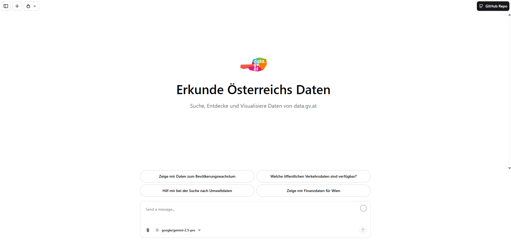

# IFG Agentic

Entdecke, Analysiere und Visualisiere österreichische Datensätze von **[data.gv.at][datagvat_url]** – komplett im Browser.

[![Next.js][nextjs_badge]][nextjs_url]
[![TypeScript][typescript_badge]][typescript_url]
[![React][react_badge]][react_url]
[![License][license_badge]][license_url]

[Deutsche Version](#readme-top) · [English Version][readme_en_url]

[![Repository][repo_badge]][repo_url]
[![Issues][issues_badge]][issues_url]
[![Data.gv.at][datagvat_badge]][datagvat_url]

## Features

- **Zero Setup** – Nur Browser benötigt, Python läuft via [Pyodide][pyodide_url].
- **Multi-Model AI** – Support für 100+ Modelle.
- **Natural Language Search** – Durchsuche den [data.gv.at][datagvat_url] Katalog mit natürlicher Sprache.
- **Automatische CSV-Analyse** – Erkennt Delimiter, Encoding und Datentypen automatisch.
- **Code-Generierung** – Generiert ausführbaren Python-Code (pandas/matplotlib) für Analysen und Visualisierungen.
- **Safeguards** – Safeguards verhindern, dass die AI erfundene Daten verwendet.
- **Datumsformat** – Versteht DD.MM.YYYY Datumsformate und Komma-Dezimaltrennzeichen.
- **Browser only** – Code läuft direkt im Browser ohne Backend-Dependencies.
- **Tabellenansicht** – Zeigt Daten in editierbaren Tabellen an.

[&nwarr; Back to top](#readme-top)

## Tech Stack

- **[Next.js 15][nextjs_url]** – React Framework mit App Router und Server Components
- **[TypeScript][typescript_url]** – Type-safe JavaScript
- **[React 19][react_url]** – UI Library
- **[Vercel AI SDK][vercel_ai_url]** – AI/LLM Integration mit Multi-Provider Support
- **[Pyodide][pyodide_url]** – Python im Browser (pandas, matplotlib, numpy)
- **[Tailwind CSS][tailwind_url]** – Utility-first CSS Framework
- **[Radix UI][radix_url]** – Accessible Component Primitives
- **[CodeMirror][codemirror_url]** – Code Editor mit Python Syntax Highlighting
- **[Drizzle ORM][drizzle_url]** – Type-safe Database ORM
- **[PostgreSQL][postgres_url]** – Relationale Datenbank
- **[NextAuth][nextauth_url]** – Authentication für Next.js
- **[Framer Motion][framer_url]** – Animation Library
- **[Playwright][playwright_url]** – End-to-End Testing
- **[Biome][biome_url]** – Fast Linter und Formatter

[&nwarr; Back to top](#readme-top)

Made for Open-Data Transparency 🇦🇹

Built with [Vercel AI SDK][vercel_ai_url] • Powered by [data.gv.at][datagvat_url]

<!-- Badge Links -->
[nextjs_badge]: https://img.shields.io/badge/Next.js-15-black?style=for-the-badge&logo=next.js&logoColor=white
[typescript_badge]: https://img.shields.io/badge/TypeScript-5.6-3178C6?style=for-the-badge&logo=typescript&logoColor=white
[react_badge]: https://img.shields.io/badge/React-19-61DAFB?style=for-the-badge&logo=react&logoColor=black
[license_badge]: https://img.shields.io/badge/License-MIT-success?style=for-the-badge
[repo_badge]: https://img.shields.io/badge/REPOSITORY-gray?style=for-the-badge
[issues_badge]: https://img.shields.io/badge/ISSUES-red?style=for-the-badge
[datagvat_badge]: https://img.shields.io/badge/DATA.GV.AT-blue?style=for-the-badge

<!-- Technology Links -->
[nextjs_url]: https://nextjs.org/
[typescript_url]: https://www.typescriptlang.org/
[react_url]: https://react.dev/
[vercel_ai_url]: https://sdk.vercel.ai/
[pyodide_url]: https://pyodide.org/
[tailwind_url]: https://tailwindcss.com/
[radix_url]: https://www.radix-ui.com/
[codemirror_url]: https://codemirror.net/
[drizzle_url]: https://orm.drizzle.team/
[postgres_url]: https://www.postgresql.org/
[nextauth_url]: https://next-auth.js.org/
[framer_url]: https://www.framer.com/motion/
[playwright_url]: https://playwright.dev/
[biome_url]: https://biomejs.dev/

<!-- AI Provider Links -->
[gemini_url]: https://ai.google.dev/
[openai_url]: https://openai.com/
[xai_url]: https://x.ai/

<!-- Repository Links -->
[repo_url]: https://github.com/julian-at/ifg-agentic
[issues_url]: https://github.com/julian-at/ifg-agentic/issues
[license_url]: https://github.com/julian-at/ifg-agentic/blob/main/LICENSE
[readme_en_url]: https://github.com/julian-at/ifg-agentic/blob/main/README_EN.md

<!-- External Links -->
[datagvat_url]: https://www.data.gv.at/
[vercel_url]: https://vercel.com/
